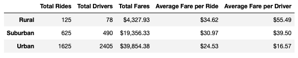

# Module 5 PyBer_Analysis

## Overview of Project
Using Python, Pandas, & Matplotlib to Analyze PyBer Ridesharing Results with Jupyter Notebooks

### Purpose
PyBer, a ridesharing app company, has requested the following:
* Create a summary DataFrame of the ride-sharing data by city type.
* Using Pandas and Matplotlib, create a multiple-line graph that shows the total weekly fares for each city type.
* Submit a written report that summarizes how the data differs by city type and how those differences can be used by decision-makers at PyBer.
 
## Results (Differences in Ride-sharing Data Among the Different City Types)

### Summary PyBer Data by City Type

Urban cities had the highest number of rides (1625).
Per the summary chart above, the total rides decreased from Urban to Suburban by 1000 rides, and by 1500 comparing Urban to Rural.

### Differences in total drivers

Urban cities had the highest number of drivers (2405).
The number of drivers decreased significantly as you went from Suburban down to Rural cities.

### Differences in total fares (See 
Urban cities had the largest amount of total fares ($39,854.38)
As would be expected, the total fares decreased as well from Urban to Suburban to Rural

### Differences in average fare per ride and driver
Urban cities had the lowest Average fare both per Ride ($24.53) and per Driver ($16.57).

### Differences in total fare by city type.

#### Link to Election Analysis Link: [Election_Analysis](analysis/election_analysis.txt)

## Election-Audit Summary: 
This script could be modified to pull and display any number of regional data points such as state and city, allowing analysis at those levels as well.  This could easily be run by adding a City and State column to the .csv file and reading data in the same way as county information.
By modifying the dictionaries within the code, the election commision could view percentage of the county vote and county vote total per candidate. 

